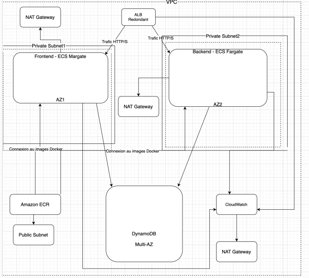

1) Liste des composants pour l'application :

VPC (Virtual Private Cloud) : Environnement réseau isolé pour les ressources AWS.

Application Load Balancer (ALB) : Dirige le trafic vers les instances ECS Fargate.

ECS Fargate Instances (Frontend et Backend) : Héberge le frontend et le backend dans deux zones de disponibilité (AZ1 et AZ2).

Base de Données (DynamoDB) : Stockage durable et scalable des données.

Amazon ECR : Stocke les images Docker nécessaires aux déploiements sur ECS Fargate.

Amazon CloudWatch : Surveillance et collecte des métriques pour l'ensemble de l'infrastructure.

NAT Gateway : Permet aux instances privées d'accéder à l'internet de manière sécurisée.   

Public Subnet : Contient les ressources nécessitant un accès direct à Internet
                       
                       
                       
2) schéma de l'infrastructure                      
                  
            

3) Justifions les choix techniques

- Application Load Balancer (ALB)
Équilibrage de charge : Dirige le trafic utilisateur vers les instances disponibles, répartissant uniformément la charge et améliorant la résilience.
Haute disponibilité : En équilibrant le trafic entre plusieurs zones de disponibilité, l'ALB garantit que  l'application reste accessible même si une zone devient indisponible.

- ECS Fargate  (Frontend et Backend)
Serverless : ECS Fargate permet de déployer et de gérer des conteneurs Docker sans avoir à gérer l'infrastructure sous-jacente. Cela simplifie la gestion des ressources et réduit la charge administrative.
Scalabilité : Les instances peuvent automatiquement monter en charge en fonction de la demande, assurant ainsi une performance optimale.

- Base de Données (DynamoDB )
Durabilité et scalabilité : DynamoDB est une base de données NoSQL entièrement managée et Aurora Serverless une base de données relationnelle, toutes deux capables de gérer de grandes quantités de données avec une haute disponibilité.

- Multi-AZ : La capacité multi-AZ garantit la redondance et l'accessibilité des données même en cas de défaillance d'une zone de disponibilité.

- Amazon ECR
Stockage centralisé : Permet de stocker et de gérer les images Docker nécessaires aux déploiements, facilitant ainsi les mises à jour et les déploiements continus.

- Amazon CloudWatch
Surveillance et gestion : Collecte des métriques, des logs et des événements, ce qui permet une surveillance en temps réel et une gestion proactive de l'infrastructure.

- VPC (Virtual Private Cloud)
Isolation réseau : Fournit un environnement réseau isolé et sécurisé pour toutes les ressources AWS, permettant de définir des sous-réseaux, des tables de routage et des configurations de pare-feu.

- NAT Gateway
Accès internet : Permet aux instances dans les sous-réseaux privés d'accéder à l'internet pour les mises à jour ou les communications sortantes, tout en assurant que les instances ne sont pas directement accessibles depuis l'internet, renforçant ainsi la sécurité.

- Subnet : améliore la sécurité, l'efficacité, la performance, et la gestion des ressources, tout en permettant une scalabilité et une haute disponibilité optimales.

Ces choix techniques visent à maximiser la disponibilité, la scalabilité et la sécurité l'application tout en minimisant la charge administrative grâce à des services managés et serverless.

4) Service pour stocker les images Docker : Amazon Elastic Container Registry (ECR)